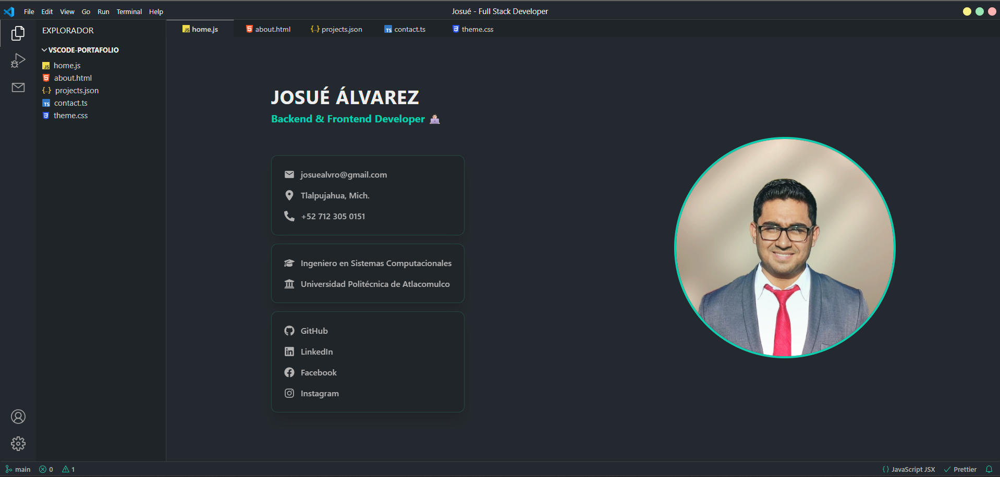

# Reactfolio V2.1 con tema de Visual Studio Code

Reactfolio Visual Studio Code es una plantilla moderna y personalizable para portafolios personales, creada con la biblioteca React. Permite a desarrolladores, diseñadores y creativos mostrar su trabajo, habilidades y logros de una manera profesional y visualmente atractiva. Su diseño responsivo y código limpio hacen que sea fácil de personalizar según las necesidades individuales, siendo una opción ideal para quienes buscan un portafolio en línea impactante.

## Índice

- [Overview](#overview)
  - [Screenshot](#screenshot)
  - [Links](#links)
- [My Process](#my-process)
  - [Built With](#built-with)
- [How to Use](#how-to-use)
- [Make It Your Own](#make-it-your-own)
- [Deploy on Vercel](#deploy-on-vercel)
- [Deploy en GitHub Pages](#deploy-en-github-pages)
- [Use Your Own Email API](#use-your-own-email-api)
- [Contribuir al proyecto](#-contribuir-al-proyecto)
- [Licencia](#-licencia)

---

## Overview

### Screenshot



### Links

- **Live Demo**: [https://josuedevx.github.io/portafoliov2/](https://josuedevx.github.io/portafoliov2/)

---

## My Process

### Built With

- [Vite](https://vitejs.dev/) – Frontend
- [React](https://reactjs.org/) – Biblioteca para crear interfaces de usuario
- [TypeScript](https://www.typescriptlang.org/) – JavaScript
- [Chakra UI](https://chakra-ui.com/) – Biblioteca de componentes para estilizar
- [EmailJS](https://www.emailjs.com/) – Para la función de envío de correo electrónico
- [Formik](https://formik.org/) – Para la gestión de formularios

---

## How to Use

1. **Abre** este repositorio a tu cuenta de GitHub.
2. **Clona** el repositorio:
   ```bash
   git clone git@github.com:josuedevx/portafoliov2.git
   ```
3. Ve a la carpeta del proyecto:
   ```bash
   cd portafoliov2
   ```
4. Instala todas las dependencias:
   ```bash
   npm install
   ```
5. Inicia el servidor de desarrollo:
   ```bash
   npm run dev
   ```
6. Abre tu navegador y ve a [http://localhost:5173](http://localhost:5173) para ver su versión local.

---

## Make It Your Own

Este proyecto fue diseñado para ser **fácil de desarrollar y personalizable**.

- Ve a la carpeta `/public/data`.
- Encontrarás archivos simples `.ts` que contienen tu:
  - Biografía
  - Habilidades
  - Proyectos
  - Información de contacto
- Modifica esos objetos JavaScript con tu propio contenido.
- Reinicia el servidor dev para aplicar los cambios:
  ```bash
  npm run dev
  ```

No es necesaria ninguna configuración complicada.

---

## Deploy on Vercel

Puedes **desplegar este portafolio en minutos** utilizando [Vercel](https://vercel.com/):

1. **Fork** el repositorio.
2. Dirígete a [https://vercel.com/new](https://vercel.com/new).
3. Conecta tu cuenta de GitHub e importa tu repositorio.
4. Vercel detectará automáticamente la configuración del proyecto (no es necesario configurarlo manualmente).
5. ¡Haga clic en **Deploy**, y tu portafolio estará en vivo casi al instante!

> Todos los ajustes necesarios de Vercel ya están en su lugar en la estructura del proyecto.

---

## Deploy en GitHub Pages

Puedes **publicar este portafolio directamente en GitHub Pages** siguiendo estos pasos:

## 1. Asegúrate de tener el campo `homepage` en `package.json`

```json
"homepage": "https://<TU_USUARIO>.github.io/<NOMBRE_DEL_REPO>"
```

Ejemplo:

```json
"homepage": "https://josuedevx.github.io/portafoliov2"
```

---

## 2. Instala la dependencia `gh-pages`

```bash
npm install gh-pages --save-dev
```

---

## 3. Configura `vite.config.ts` con la base del repositorio

```ts
// vite.config.ts
import { defineConfig } from "vite";
import react from "@vitejs/plugin-react";

export default defineConfig({
  base: "/portafoliov2/",
  plugins: [react()],
});
```

> Reemplaza `"portafoliov2"` por el nombre real de tu repositorio si lo cambias.

---

## 4. Agrega los scripts de despliegue en `package.json`

```json
"scripts": {
  "predeploy": "npm run build",
  "deploy": "gh-pages -d dist"
}
```

---

## 5. Ejecuta el despliegue

```bash
npm run deploy
```

Esto generará el build y lo publicará en la rama `gh-pages` de tu repositorio.

---

## ✅ Resultado

Tu sitio estará disponible en:

```
https://<TU_USUARIO>.github.io/<NOMBRE_DEL_REPO>
```

Ejemplo:

```
https://josuedevx.github.io/portafoliov2
```

---

> ℹ️ Si cambias el nombre del repositorio o tu usuario de GitHub, recuerda actualizar el campo `homepage` en `package.json` y la propiedad `base` en `vite.config.ts`.

---

## Use Your Own Email API

Este proyecto utiliza un **custom-built backend** desplegado en [Vercel](https://vercel.com/), que utiliza **Nodemailer** para la funcionalidad de correo electrónico.

Si deseas utilizar tu propia instancia de API:

1. Visita el repositorio backend: [https://github.com/josuedevx/email-sender](https://github.com/josuedevx/email-sender)
2. Sigue las instrucciones de su `README.md` para:
   - Configurar el servidor de correo electrónico
   - Configurar un Gmail para enviar correos electrónicos
   - Desplegar la API en Vercel o en la plataforma que prefieras
3. Una vez desplegada, actualiza el archivo frontend:
   - Abre `/src/utils/sendEmail.ts`
   - Sustituye la URL de tu API desplegada:
     ```ts
     return await fetch("https://your-vercel-deployment.vercel.app/send", {
       method: "POST",
       headers: { "Content-Type": "application/json" },
       body: JSON.stringify({
         name,
         email,
         subject,
         message,
         receiver_email,
       }),
     });
     ```

---

## 🤝 **Contribuir al proyecto**

¡Todas las contribuciones son bienvenidas! Si deseas mejorar el Portafolio, puedes:

✅ Reportar errores (issues)  
✅ Sugerir nuevas funcionalidades  
✅ Enviar pull requests con mejoras

---

## 📄 **Licencia**

Este proyecto está bajo la licencia MIT. Puedes utilizarlo, modificarlo y compartirlo libremente.

---

📢 **¿Preguntas o sugerencias?**  
¡No dudes en contactarme a través de mis redes sociales o abrir un issue en el repositorio! 🚀✨
